# Write up – Wonderland

## מבוא

את תהליך המחקר התחלנו בהעלאת קובץ הריצה `wonderland.exe` לדיסאסמבלר שלנו (IDA). שלא כמו בחלק הראשון של המטלה, פונקציית ה-`main` גלויה מיד בחלקו השמאלי של המסך ברשימת הפונקציות.

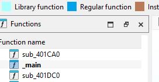

מכיוון שהפעולה הראשונה של התוכנית בזמן ריצה היא בקשת קלט של "בחירת שלב", המטרה המיידית שלנו בתוך פונקציית ה-`main` היא לאתר את מנגנון הניתוב הזה שמפנה אותנו לכל אחד מהשלבים.

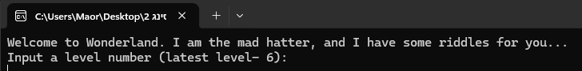

כאשר סורקים את זרימת התוכנית בגרף, מחפשים התפצלויות משמעותיות שמכוונות את הלוגיקה. זיהינו פיצול כזה לאחר הבלוק `loc_401D70` – נתיב ימני שמוביל לשגיאה למקרה של "שלב לא קיים", ונתיב שמאלי שממשיך את הפעולה התקינה.

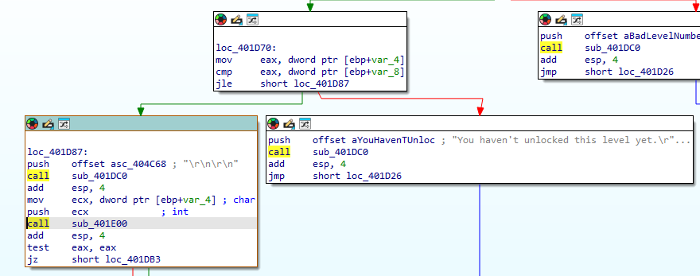

כדי לייעל את החיפוש, התמקדנו בפעולות ה-`call` בנתיב התקין, שכן הן אלו שיובילו אותנו לפונקציות החיצוניות הרלוונטיות. איתרנו שתי פעולות קריטיות כאלו:

**הקריאה לפונקציית ההדפסה**
הקריאה הראשונה מובילה לפונקציה המבצעת את פעולת ההדפסה (ה-`printf` של התוכנית, שמבקש את הקלט מהמשתמש). כשצוללים לתוך פונקציה זו, רואים בבירור את פקודת ההדפסה למערכת ההפעלה.

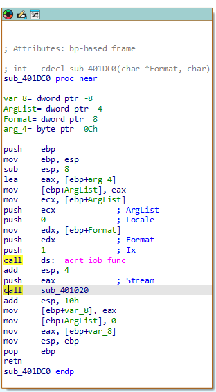
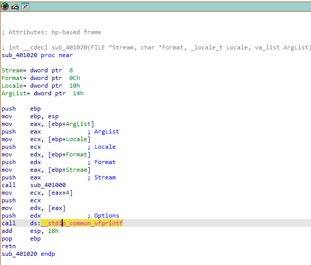

**הקריאה לניתוב השלבים**
הפעולה השנייה לוקחת אותנו אל ה"קייס מאסטר" – הפונקציה שאחראית לקחת את מספר השלב שהוזן ולפצל את התוכנית למקרים, כאשר כל מקרה מוביל לשלב אחר באתגר.

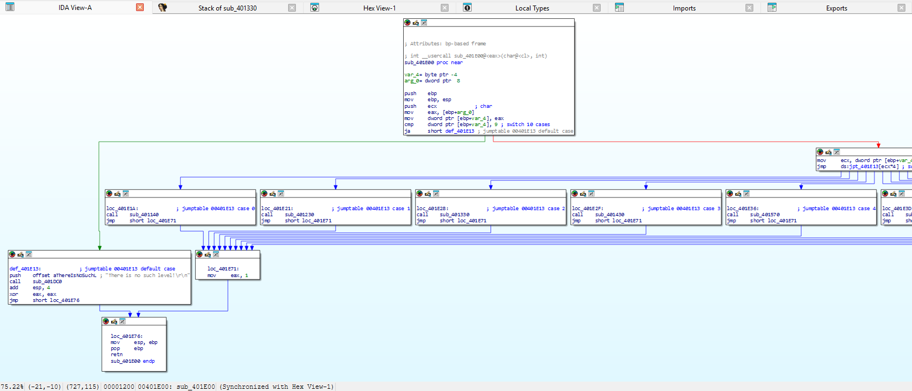

ניתן לראות בבירור כיצד מתוך הניתוב הזה כל שלב מקבל קריאת `call` ייעודית שקופצת לפונקציה שלו. בגלל ששלבים 0-1 נפתרו ע''י המרצה, נתחיל ישירות מניתוח שלב 2.

---

## שלב 2

נכנסנו לפונקציה שאחראית על השלב השני (בכתובת `00401330`).
כשאנחנו מסתכלים על הגרף, הבלוקים הראשונים מראים התעסקות די סטנדרטית של קבלת קלט. 

התוכנית מקצה מקום בזיכרון ואז קוראת ל-`memset` בכדי לאפס אותו, משתמשת ב-`fgets` בכדי לקלוט את המחרוזת שהזנו, ומיד קוראת ל-`strlen` בכדי לשמור את אורך הקלט במשתנה מקומי. נקודה שחשוב לציין פה היא שהתוכנית קוראת את הנתונים בגושים של 4 בתים, מה שישפיע על אופן הפעולה שלה בהמשך.

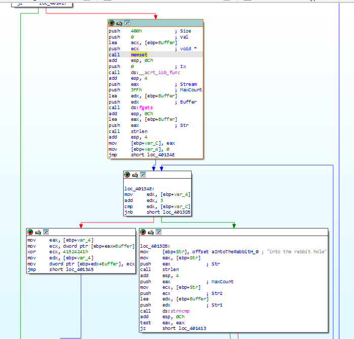

לאחר קבלת הקלט הגרף מתפצל. כדי לא ללכת לאיבוד בפיצולים המשניים, עקבנו אחרי הנתיב המרכזי הימני שלמעשה מכניס אותנו אל תוך שרשרת הבלוקים של לולאת העיבוד. בשלב זה, כדי להבין במדויק את סדר הפעולות של המעבד על הקלט ולוודא את מהות הלולאה החריגה, העברנו את התצוגה ממצב גרף למצב טקסט.

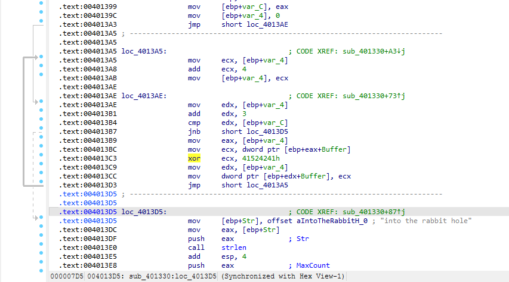

בהסתכלות מהירה על תוכן הלולאה במצב הטקסט, אפשר לשים לב לשורה חריגה וקריטית: ניתן לראות בבירור פעולת `XOR` מול מספר הקסדצימלי. 

התוכנית עוברת על הקלט שלנו ב"דילוגים" של 4 בתים ומבצעת עליו `XOR` מול הערך `41524241h`. מכיוון שהזיכרון קורא את הנתונים הפוך, נהפוך את רצף הבתים ונקבל את המילה `ABRA` – שהיא למעשה מילת המפתח להצפנה של הסיסמה.

אם נחזור ונסתכל על הנתיב הימני המייצג את בלוק היציאה מהלולאה, נראה שאנחנו טוענים למעבד מחרוזת קבועה הנמצאת בזיכרון.

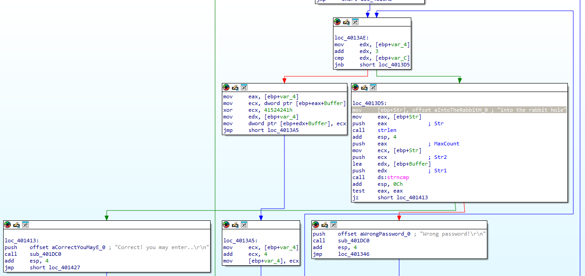

משמע, התוכנית שלנו לוקחת את הקלט שלנו (אחרי שעבר `XOR` מול `ABRA`), ובודקת האם הוא שווה למחרוזת היעד (`into the rabbit hole`). 

בגלל ש-`XOR` היא פעולה סימטרית והפיכה, נהפוך את הסדר ונחלץ בעזרת `XOR` של מחרוזת היעד (`into the rabbit hole`) עם המפתח (`ABRA`) את הסיסמה המקורית שעלינו להזין. ניעזר בסקריפט פייתון קצר לעזרה:

```python
target_string = "into the rabbit hole"
key = "ABRA"
password = ""

for i in range(len(target_string)):
    char_code = ord(target_string[i]) ^ ord(key[i % len(key)])
    password += chr(char_code)

print(password)
```

להלן תוצאת הרצת קוד הפייתון:

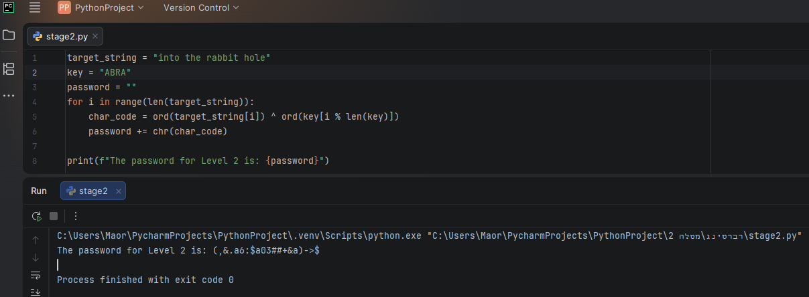

כפי שניתן לראות, הסיסמה שחילצנו היא: `(,&.a6:$a03##+&a)->$`

ולבסוף, בהזנת הסיסמה בתוך וונדרלנד, עברנו את השלב בהצלחה.

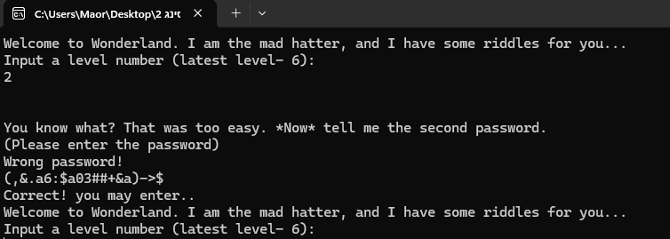

---

## שלב 3

נכנסנו לפונקציה שאחראית על השלב השלישי (בכתובת `00401430`).
הגרף מתחיל בהקצאת זיכרון של 24 בתים על המחסנית והדפסת הודעת הפתיחה. לאחר מכן, ישנו אתחול של שני משתנים לאפס (אחד מהם משמש כמונה לולאה) וקפיצה ישירה אל תנאי הלולאה המרכזית.

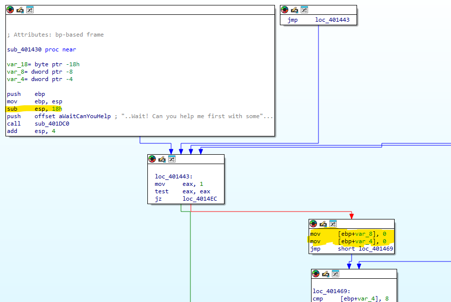

בלוק הלולאה חושף את המבנה שהתוכנית מצפה לו: ישנה קריאה לקליטת נתונים עם פורמט המחרוזת `"%hu"`. מיד לאחר מכן ישנה בדיקת גבולות – התוכנית מוודאת שהמספר שהוזן קטן משמונה. הלולאה רצה שמונה פעמים, כלומר התוכנית אוספת מאיתנו בדיוק 8 מספרים שלמים בטווח שבין 0 ל-7, ושומרת אותם לתוך מערך.

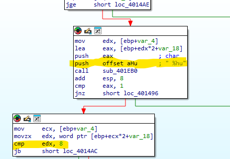

לאחר איסוף 8 המספרים, התוכנית מעבירה את המערך שלנו כארגומנט וקוראת לפונקציית אימות פנימית (`sub_4014F0`). כדי להבין מה נדרש מאיתנו, צללנו אל תוך הפונקציה הזו.

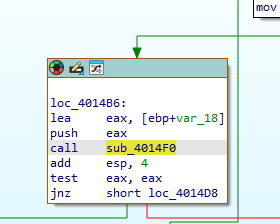

בפונקציית האימות גילינו את הלוגיקה האמיתית של השלב: התוכנית מתייחסת ל-8 המספרים שהזנו בתור אינדקסים. היא ניגשת למערך נתונים סטטי ששמור בזיכרון בכתובת `00404000`, ושולפת משם ערכים לפי האינדקסים שלנו.
מיד לאחר השליפה מתבצעת בדיקה (`cmp ecx, edx`) שמוודאת תנאי אחד פשוט: הערכים שנשלפו חייבים להיות מסודרים בסדר עולה ממש.

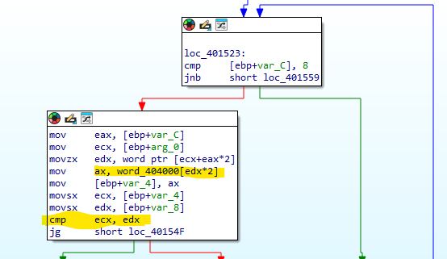

הפתרון כעת היה ברור: קפצנו לכתובת `00404000` בזיכרון, וחילצנו את שמונת הערכים האמיתיים: 
`7`, `33`, `1`, `-600`, `-5000`, `1777`, `13`, `69`.

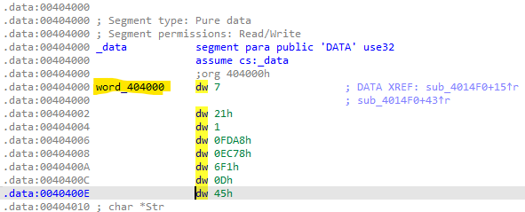

כדי שהבדיקה של התוכנית תעבור, פשוט מויננו את הערכים שמצאנו מהקטן ביותר (`-5000`) לגדול ביותר (`1777`), ורשמנו את האינדקס המקורי של כל ערך. 
סדר הערכים העולה מחזיר לנו את רצף האינדקסים הבא: 
`4 3 2 0 6 1 7 5`

הזנת הרצף הזה עונה על תנאי הפונקציה, מעבירה את השלב בהצלחה ופותחת את הדרך לשלב 4.

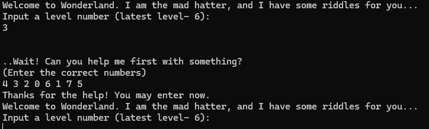

---

## שלב 4

נכנסנו לפונקציה שאחראית על השלב הרביעי (בכתובת `00401570`). 
במבט ראשון על בלוק קבלת הקלט, ניתן לזהות שינוי מגמה: במקום לקלוט מחרוזת טקסט כמו בשלבים הקודמים, הפונקציה מצפה לקבל מספר שלם. היא משתמשת בפורמט הקלט `"%du"` ושומרת את הערך המספרי שהזנו לתוך משתנה מקומי בשם `Str1`.

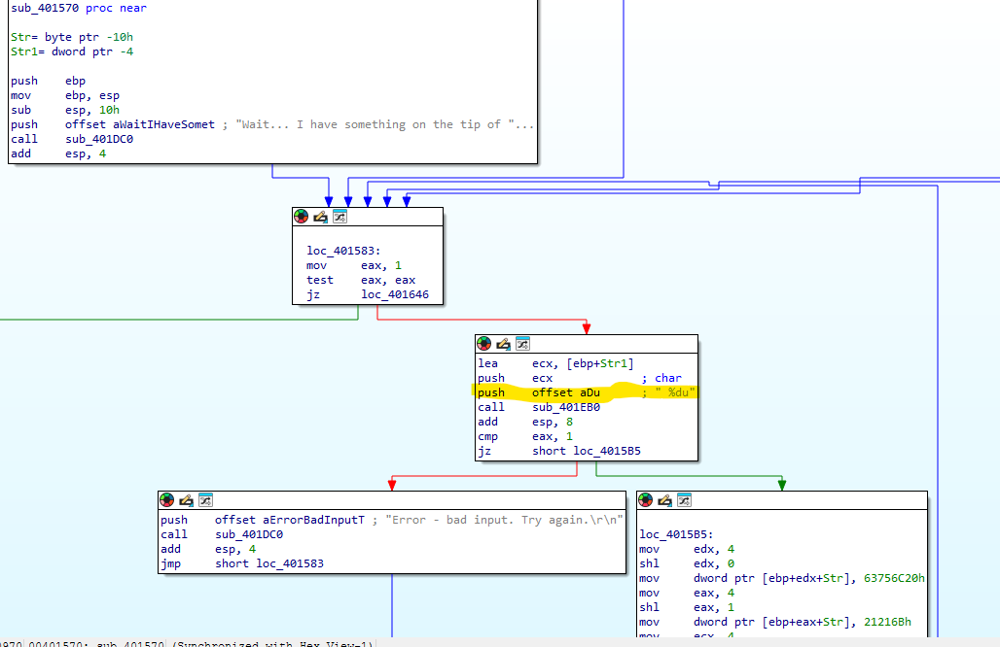

מיד לאחר קליטת המספר, התוכנית עוברת לבלוק מעניין מאוד שבו היא מרכיבה בעצמה מחרוזת באופן דינמי. היא עושה זאת על ידי הכנסת ערכים הקסדצימליים לתוך הזיכרון:
* `646F6F47h` (מתורגם ל-"Good")
* `63756C20h` (מתורגם ל-" cul")
* `21216Bh` (מתורגם ל-"k!!")

חיבור של הערכים הללו יוצר את המחרוזת `"Good luck!!"`, אשר נשמרת במשתנה המקומי `Str`.

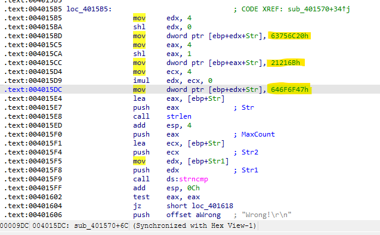

הלוגיקה המרכזית של השלב נחשפת בקריאה לפונקציית ההשוואה `strncmp`. התוכנית לוקחת את המספר שהזנו כקלט ומתייחסת אליו בתור כתובת בזיכרון. היא ניגשת לכתובת הזו, ובודקת האם קיימת שם המחרוזת `"Good luck!!"`.

עם זאת, התוכנית כוללת מנגנון הגנה. מיד לאחר מציאת התאמה, היא בודקת האם הכתובת שהזנו היא הכתובת של המשתנה `Str` (המחרוזת שהיא עצמה הרכיבה הרגע). אם הכתובות זהות, היא מדפיסה הודעת שגיאה וזורקת אותנו החוצה. 

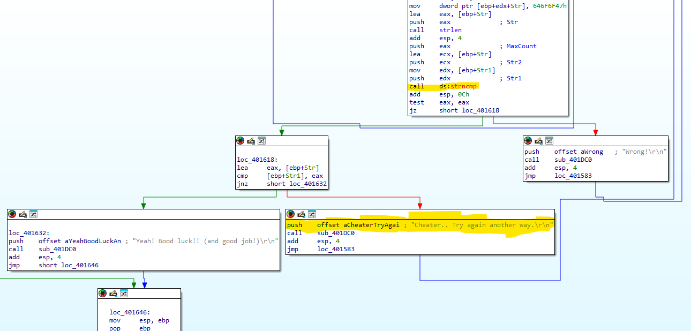

משמעות הדבר היא שאנחנו צריכים למצוא מקום אחר בקובץ הריצה שבו שמורה המחרוזת `"Good luck!!"`, ולהזין את הכתובת המדויקת שלו. 

כדי למצוא את הכתובת, חזרנו להסתכל על רשימת המחרוזות הקבועות בזיכרון התוכנית. שמנו לב שהודעת ההצלחה של שלב 4 עצמו מכילה בדיוק את מה שאנחנו מחפשים: `"Yeah! Good luck!! (and good job!)"`. 
קפצנו למקטע הנתונים כדי לראות באיזו כתובת יושבת הודעת ההצלחה.

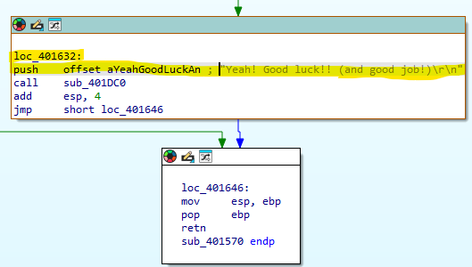

המחרוזת השלמה מתחילה בכתובת המקורית שלה בזיכרון. מכיוון שאנחנו צריכים להצביע בדיוק על האות `G` של המילה `Good`, היינו צריכים לחשב את הכתובת המדויקת של האות הזו בתוך המשפט השלם (דילוג על 6 התווים הראשונים).

לאחר חישוב הכתובת המדויקת, ומכיוון שפונקציית הקלט מצפה למספר עשרוני, המרנו את כתובת הזיכרון שמצאנו למספר עשרוני וקיבלנו: `4212542`.

הזנת המספר הזה מצביעה בדיוק על המחרוזת המבוקשת בזיכרון, עוקפת את מנגנון ההגנה, ומעבירה אותנו בהצלחה לשלב 5.

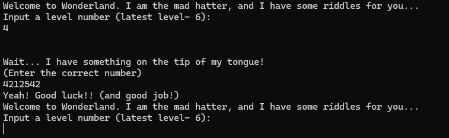

---

## שלב 5

נכנסנו לפונקציה שאחראית על השלב החמישי והאחרון (בכתובת `00401650`). 
במבט ראשון, ניתן להבחין בשינוי לוגי מוחלט לעומת השלבים הקודמים. התוכנית קוראת לקלט, אך מיד לאחר מכן ניגשת לתו האחרון בקלט שלנו (תו ירידת השורה) ודורסת אותו עם אפס כדי לסיים את המחרוזת. 
מיד באותו בלוק, התוכנית קוראת לפונקציית המערכת `CreateFileA` ומעבירה את הקלט שלנו בתור נתיב לקובץ. הפעולות הללו נועדו להפוך את הקלט למחרוזת חוקית של נתיב במערכת, ולנסות לפתוח קובץ קיים לקריאה.

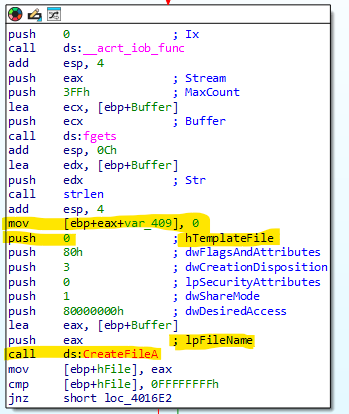

אם הקובץ קיים, התוכנית ממשיכה לבלוק הבא וקוראת ל-`ReadFile` כדי לקרוא את התוכן של הקובץ שלנו אל תוך הזיכרון, ולאחר מכן סוגרת אותו.

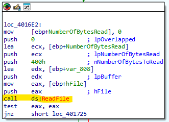

התוכן שנקרא נשלח לפונקציית בדיקה פנימית בכתובת `sub_401770`. 
כאשר נכנסנו לפונקציית הבדיקה וניתחנו אותה, ראינו שהיא משתמשת במבנה של `Switch-Case` שעובר בלולאה על התווים מקובץ הקלט שלנו.

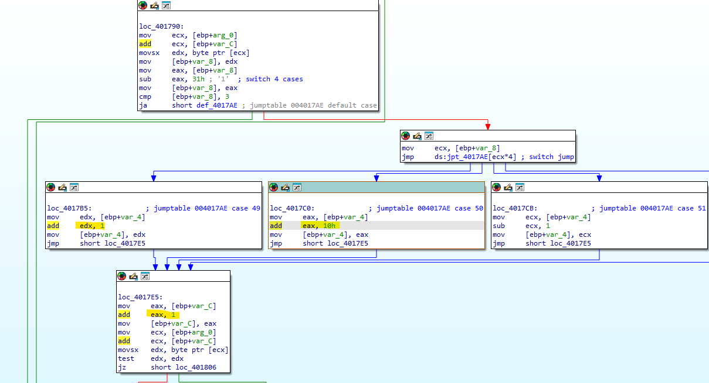

התרגום של המבנה וההוראות היה כזה:
* הספרה '1' מבצעת תנועה ימינה
* הספרה '2' מבצעת חיבור של 16, כלומר ירידה שורה אחת למטה
* הספרה '3' מבצעת תנועה שמאלה
* הספרה '4' מבצעת חיסור של 16, כלומר עלייה שורה אחת למעלה

התוכנית מוודאת שאחרי כל צעד אנחנו "נוחתים" על התו `.` (נקודה) במחרוזת קבועה בזיכרון, ושהיעד הסופי שלנו הוא התו `'X'`. מכיוון שהדילוג מעלה/מטה הוא של 16 תווים, הבנו שמדובר במבוך דו-מימדי שרוחבו 16 תווים.

כדי להבין באיזה מבוך מדובר, עלינו לראש פונקציית הבדיקה. שם זיהינו טעינה של כתובת מהזיכרון השמורה תחת התווית `Str`. התוכנית דוחפת את האות `'O'` ומחפשת אותה בתוך הכתובת הזו בתור נקודת התחלה.

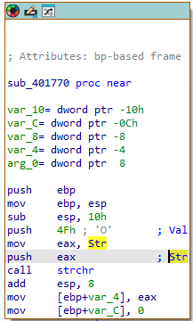

ביצענו קפיצה מהמשתנה `Str` היישר אל אזור הנתונים בזיכרון, שם מצאנו את המחרוזת הגולמית הארוכה שמייצגת את המבוך.

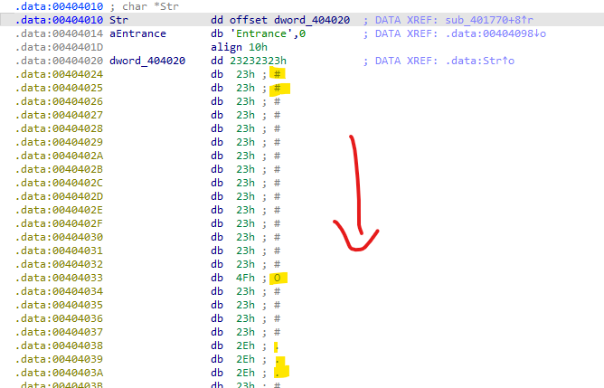

העתקנו את המחרוזת הגולמית לעורך טקסט וחתכנו שורה כל 16 תווים. הפעולה הזו חשפה בפנינו את המבוך בצורתו הדו-מימדית והציגה מסלול ברור מנקודת ההתחלה ('O') ועד הסיום ('X').

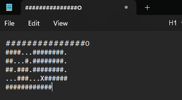

תרגמנו את הכיוונים לספרות המתאימות וקיבלנו את הרצף המנצח:
`2221114411411222111`

יצרנו קובץ טקסט פשוט בשם `maze.txt` בתיקייה המקומית, והכנסנו לתוכו את הרצף המדויק.

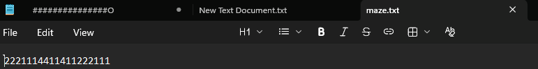

כאשר וונדרלנד ביקש קלט בשלב 5 – הזנו את הנתיב המלא לקובץ שיצרנו. התוכנית קראה את הקובץ, ניווטה במבוך, ועברנו את האתגר במלואו.

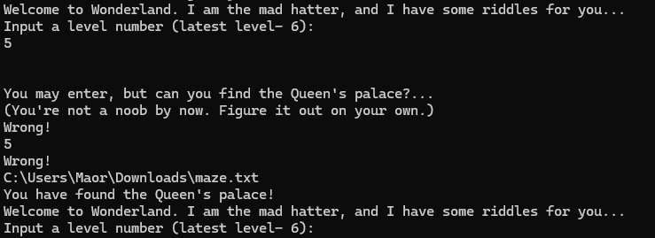
